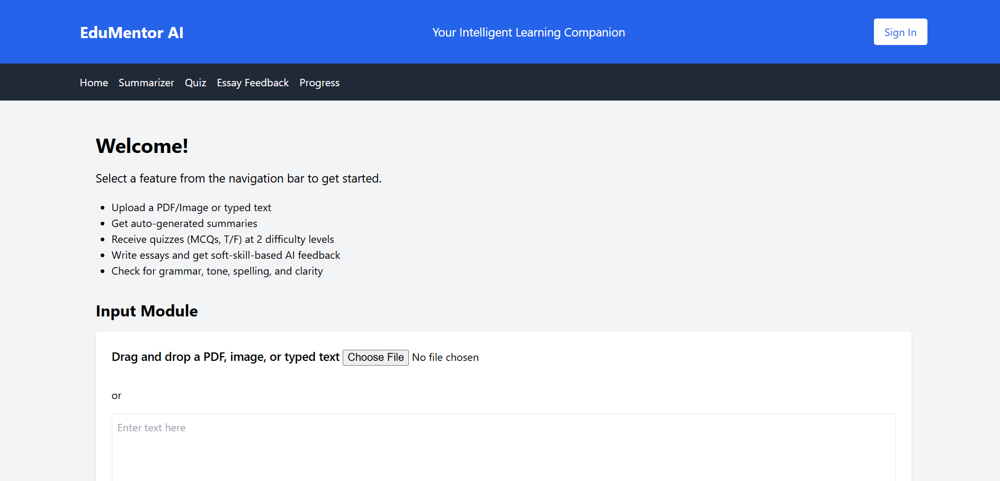

# 🤖 EduMentor AI

AI-powered educational platform designed to help students learn more effectively through intelligent content summarization, quiz generation, essay feedback, and progress tracking.

---

## 🚀 Features

* 📄 AI-Powered Content Summarization
* 📝 Automatic Quiz Generation
* ✍️ Essay Feedback & Evaluation
* 📊 Student Progress Tracking
* 🎯 Personalized Learning Experience
* 🌐 User-Friendly Interface

---

## 🛠️ Tech Stack

### Backend

* Python
* Flask

### Frontend

* HTML
* CSS
* JavaScript

### AI Integration

* OpenAI API
* Google Gemini API

### Tools

* Git
* GitHub
* VS Code

---

## 📸 Project Screenshots

### 🚀 Start Page


---

### 🏠 Home Page



---

### 📝 Input Module


---

### 🧠 Quiz Generation


---

### ✍️ Essay Feedback


---

### 📊 Progress Tracker


---

## ⚙️ Installation

### Clone Repository

```bash
git clone https://github.com/Vedant-Satish-Mishra/EduMentor-AI.git
```

### Move Into Project Directory

```bash
cd EduMentor-AI
```

### Install Dependencies

```bash
pip install -r requirements.txt
```

### Run Application

```bash
python app.py
```

---

## 🎯 Project Objective

EduMentor AI was developed to enhance the learning experience by leveraging Artificial Intelligence for educational assistance. The platform helps students quickly understand large content, generate quizzes for self-assessment, receive essay feedback, and track learning progress.

---

## 🔮 Future Enhancements

* PDF Upload Support
* MCQ Generator
* User Authentication
* Learning Analytics Dashboard
* AWS Cloud Deployment
* Docker Containerization

---

## 👨‍💻 Author

**Vedant Mishra**

📍 Akola, Maharashtra, India

💼 Open to Internship Opportunities

🔗 LinkedIn:
https://www.linkedin.com/in/vedant-mishra-1920aa328

---

⭐ If you found this project useful, consider giving it a star.
